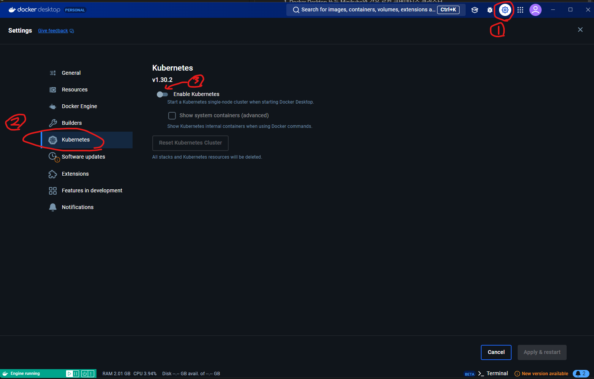
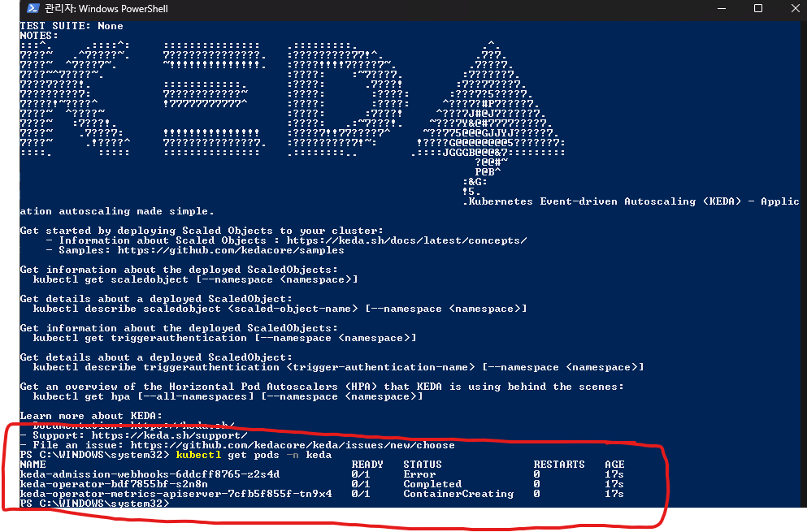
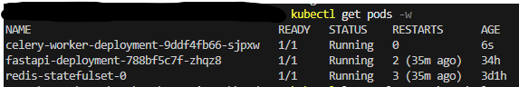
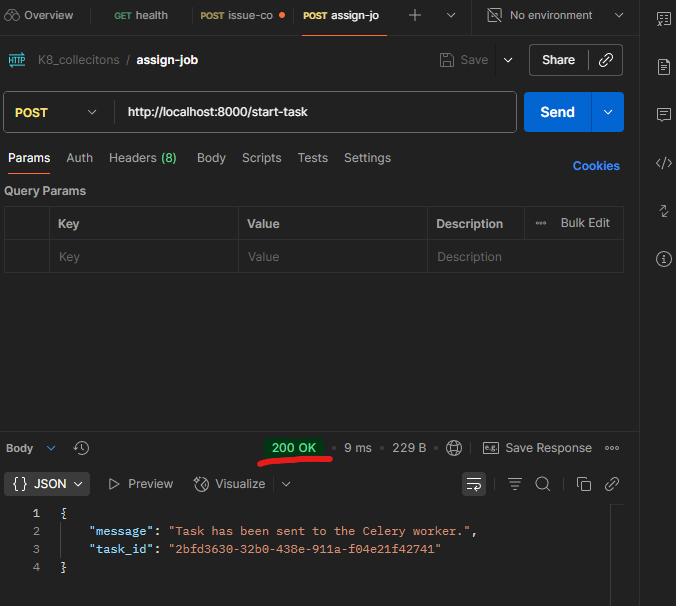
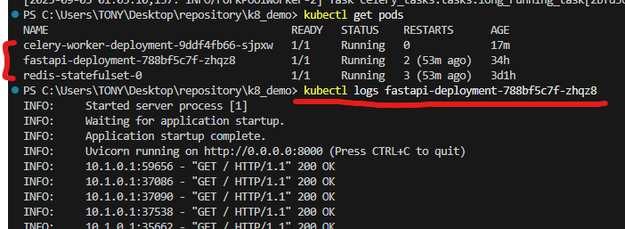
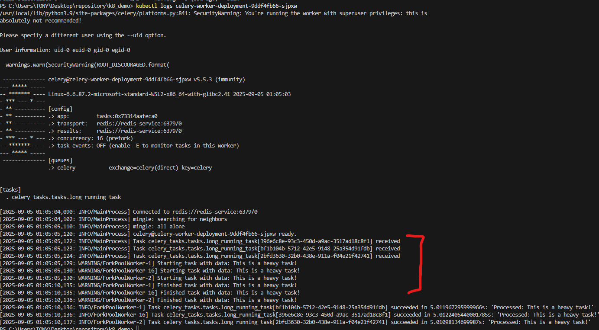
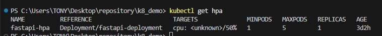

# FastAPI & Celery 자동 확장(Auto-scaling) 프로젝트
이 프로젝트는 쿠버네티스 환경에서 트래픽 및 작업 부하에 따라 FastAPI와 Celery Worker Pod 수를 자동으로 조절하는 방법을 보여줍니다.

### **사전 준비**
1. Docker Desktop 로컬 쿠버네티스 클러스터
2. kubectl CLI
3. github repository 소스 코드
4. KEDA를 위한 helm
5. 윈도우 환경

## 1단계: Docker의 쿠버네티스 설정

### Docker Desktop에서 Kubernetes 활성화 



Docker Desktop을 실행하고 Settings > Kubernetes 메뉴로 이동하여 Enable Kubernetes 체크박스를 활성화합니다.


### KEDA를 위한 Helm 설치.

1. `choco install kubernetes-helm` 으로 윈도우에서 helm을 설치 해 줍니다.

> 만약 choco 명령어가 말을 듣지 않는다면 powershell을 관리자 권한으로 열으셔서 `Set-ExecutionPolicy Bypass -Scope Process -Force; [System.Net.ServicePointManager]::SecurityProtocol = [System.Net.ServicePointManager]::SecurityProtocol -bor 3072; iex ((New-Object System.Net.WebClient).DownloadString('https://community.chocolatey.org/install.ps1'))` <- 명령어를 쳐 줍니다. 그 다음, `choco install kubernetes-helm`을 쳐서 helm을 설치 합니다.

2. helm repo update Helm한테 Keda 설치 패키지 장소를 알려줍니다.
```
helm repo add kedacore https://kedacore.github.io/charts
helm repo update
```

3. KEDA를 쿠버네티스 클러스터에 설치

`helm install keda kedacore/keda --namespace keda --create-namespace`

4. KEDA 설치 확인

`kubectl get pods -n keda`

다음처럼 출력되어야 정상입니다.




## 2단계: Docker 이미지 빌드 및 푸시
이제 프로젝트의 루트 디렉터리(C:\...)에서 PowerShell 또는 CMD를 열고 다음 명령어를 실행하여 Docker 이미지를 빌드합니다. 이 이미지들은 Docker Hub에 올라가지 않고 사용자의 로컬 Docker 데몬에 저장됩니다.

```
# FastAPI 앱 이미지 빌드
docker build -t fastapi-app:local -f app/api/Dockerfile .

# Celery 워커 이미지 빌드
docker build -t celery-worker:local -f app/celery_tasks/Dockerfile .
```

마지막으로 `docker images`를 입력하여 이미지가 성공적으로 제작되었는지 확인한다.

다음 로그처럼 두개의 이미지가 로컬에 존재해야 한다

```
fastapi-app                                local                                                                         b69001837218   3 minutes ago   237MB
celery-worker                              local                                                                         535701121e59   26 hours ago    244MB
```

## 3단계: 쿠버네티스에 배포
프로젝트의 루트 폴더에서 아래 명령어를 순서대로 실행합니다.

여기서 중요한 점은 올바른 클러스터에서 실행 시켜 주셔야 합니다.
`kubectl config get-contexts` 을 입력하여 클러스터 목록을 확인합니다.

만약 `docker-desktop`으로 쿠버네티스가 허용이 안돼어 있다면

`kubectl config use-context docker-desktop`으로 클러스터를 변경합니다.

```
# 1. Redis 배포 (StatefulSet + Service)
kubectl apply -f redis-kubectl/

# 2. FastAPI 배포 (Deployment + Service)
kubectl apply -f fastapi-api-kubectl/

# 3. Celery 워커 배포 (Deployment + KEDA Scaler)
kubectl apply -f celery-worker-kubectl/
```

다음과 같이 pod와 로그를 확인했을 때 사진처럼 보이면 정상 작동입니다. (모든 STATUS가 Running 이여야 함)



## 4단계: 수동 테스트 해 보기

1. 먼저 postman을 통해 다음과 같이 post요청을 보냅니다.



2. 그 다음 각 pod의 로그를 확인해 성공여부를 판단합니다.

`kubectl get pods`로 pod의 고유 ID를 식별 후 `kubectl logs [ID]`를 입력해 각 pod의 로그를 다음 사진처럼 확인합니다.


Celery도 다음과 같이 출력 되어야 합니다.



## 5단계: 자동 확장(Auto-scaling) 테스트

0. 먼저 hpa (Horizontal Pod Autoscaling)이 적용되었는지 다음 명령어를 쳐서 확인해 봅니다.
`kubectl get hpa`

그러면 다음처럼 내용이 떠야 합니다.



1. 새 터미널을 열고 Pod와 HPA의 상태를 모니터링합니다. -w 플래그는 변경 사항을 실시간으로 보여줍니다.
```
# Pod 상태 모니터링
kubectl get pods -w

# HPA 상태 모니터링 (CPU 사용량과 Pod 수를 볼 수 있음)
kubectl get hpa -w
```

2. FastAPI 서비스의 외부 접속 URL을 확인합니다.
```
minikube service fastapi-service --url
```
3. `run-load-test.ps1` 또는 `run-load-test.bat` 스크립트를 열어 `$apiUrl` 또는 `API_URL` 변수에 위에서 얻은 URL을 입력합니다.

4. 스크립트를 실행하여 부하를 발생시킵니다.
```
# PowerShell
.\run-load-test.ps1

# Batch
run-load-test.bat
```

5. 모니터링하던 터미널을 확인하세요.

- API 요청이 급증하면서 FastAPI Pod의 CPU 사용량이 늘어나고, HPA가 TARGETS(예: 150%/50%)를 초과하면 새로운 FastAPI Pod가 생성되는 것을 볼 수 있습니다.

- Redis 큐에 작업이 쌓이면 KEDA가 이를 감지하여 Celery Worker Pod를 늘리는 것을 볼 수 있습니다.

- 부하 테스트가 끝나고 일정 시간이 지나면, CPU 사용량과 큐 길이가 줄어들어 Pod 수가 다시 원래대로 돌아가는 것을 확인할 수 있습니다.

## 6단계: 리소스 정리
테스트가 끝나면 아래 명령어로 모든 리소스를 삭제합니다.
```
kubectl delete -f ./celery-worker/
kubectl delete -f ./fastapi-api/
kubectl delete -f ./redis/
```